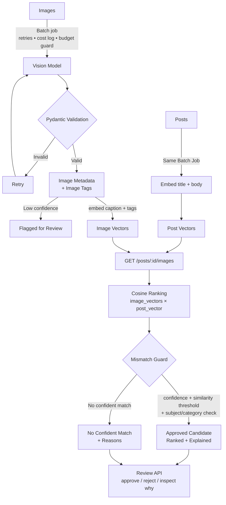

# Image Relevance Backend

AI Image Understanding & Content Matching Engine: a vision model tags an image library, embeddings match images to
posts by *meaning*, and a **mismatch guard** refuses wrong pairings (the wolf on a fox post) with a human-readable reason,
or answers "no confident match".
## Architecture




Layers: `app/models.py`, `db.py` (data) · `app/services/*`, `jobs.py` (logic) · `app/main.py` (HTTP) · `migrations/` (Alembic).
Storage is Postgres in Docker (SQLite locally). Vectors are JSON arrays + numpy cosine: fine at ~50 images (pgvector optional).

## Run it

```bash
cp .env.example .env            # add GEMINI_API_KEY (free, no card) or set PROVIDER=ollama
# put your ~46 images in data/images/ (see data/images/README.md and data/corpus_manifest.csv)
docker compose up --build       # API on http://localhost:8000 (docs at /docs)
docker compose exec api python -m scripts.seed
docker compose exec api python -m scripts.eval --sweep      # pick SIMILARITY_THRESHOLD, put it in .env
docker compose exec api python -m scripts.eval --write-readme
```

Without Docker: `pip install -r requirements.txt && python -m scripts.seed && uvicorn app.main:app`.
Tests (offline, mock provider, no key needed): `pytest -q`.

## Mismatch guard

Every check runs and *all* failures are reported, so a rejection explains itself.

| Code | Rejects when |
|---|---|
| `LOW_CONFIDENCE` | image confidence < `CONFIDENCE_MIN` (or flagged) |
| `LOW_SIMILARITY` | cosine < `SIMILARITY_THRESHOLD` (+`UNKNOWN_SUBJECT_MARGIN` if the post's subject isn't in the taxonomy) |
| `SUBJECT_MISMATCH` | same category, different subject: "Animal category mismatch: expected red fox, detected gray wolf" |
| `CATEGORY_MISMATCH` | different category entirely |
| `SUBJECT_UNVERIFIED` | post subject known but the image's subject can't be resolved to it |

The post's subject comes from `data/taxonomy.json` (canonical names + aliases, so "Vulpes vulpes" = red fox). A post about
several subjects accepts any of them. Even with a very high similarity, a wrong subject is rejected.

## API

| Endpoint | Purpose |
|---|---|
| `POST /images/ingest` | scan `IMAGE_DIR` (idempotent, sha256) |
| `POST /posts` | create/update a post (idempotent by slug) |
| `POST /jobs/process` → `GET /jobs/{id}` | batch vision + embeddings; one active job at a time |
| `GET /images?status=&flagged=` · `GET /images/{id}` | tags, confidence, flags |
| `GET /posts/{id}/images` | ranked, guarded suggestions or `no_confident_match` + reasons |
| `POST /posts/{id}/check {image_id}` | force a candidate through the guard |
| `GET /suggestions` · `GET /suggestions/{id}` · `POST /suggestions/{id}/review` | inspect why / approve / reject (approving a guard-refused pairing needs `override`) |
| `GET /costs` · `GET /costs/entries` | per-call cost log |

## Evaluation

`data/eval.json` labels the correct image(s) for 15 posts (glob patterns, e.g. `red-fox_*.jpg`) plus 2 posts with no suitable image.
Headline = share of labeled posts whose first guard-approved suggestion is a labeled image.


